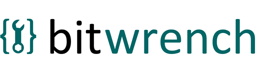

# bitwrench.js

[](https://opensource.org/licenses/BSD-2-Clause)
[](https://www.npmjs.com/package/bitwrench)
[](https://github.com/deftio/bitwrench/actions/workflows/ci.yml)
[](https://github.com/deftio/bitwrench)

[](https://deftio.github.io/bitwrench/pages/)

Bitwrench builds UI from plain JavaScript objects -- one format for components, styling, state, and server rendering, with no build step and zero dependencies.

```javascript
// Describe UI as a JavaScript object (a "TACO")
var page = {
  t: 'div', a: { class: 'card' },
  c: [
    { t: 'h2', c: 'Hello' },
    { t: 'p',  c: 'UI as native JavaScript objects.' },
    bw.makeButton({ text: 'Click me', variant: 'primary', onclick: fn })
  ]
};

bw.DOM('#app', page);          // -> live DOM
bw.html(page);                 // -> HTML string (Node.js, emails, SSR)
```

Each object has four keys: **t** (tag), **a** (attributes), **c** (content), **o** (options for state/lifecycle). Nest them, loop them, compose them -- it's just JavaScript.


### Why bitwrench?

**One file, everywhere.** At ~38KB gzipped with zero dependencies, bitwrench runs on anything with a browser -- phones, tablets, Raspberry Pi, even ESP32 microcontrollers. The device serves a single HTML page and pushes data as JSON; bitwrench handles all rendering, styling, and state on the client. No Node.js, no build step, no internet connection required.

Structure, styling, state, and server rendering are all handled as JavaScript objects:

- **No build toolchain** -- works with a `<script>` tag
- **50+ ready-made components** -- buttons, tables, modals, forms, charts, toasts -- one `make*()` call each, returns a composable TACO
- **CSS from JavaScript** -- `bw.css()` generates stylesheets, `bw.s()` composes inline styles, `bw.loadStyles()` derives a complete design system from 2 seed colors
- **Reactive state** -- `o.state` + `o.render` + `bw.update()` for stateful components; `bw.pub()`/`bw.sub()` for cross-component messaging
- **Dual rendering** -- same object renders to live DOM (`bw.DOM()`) or HTML string (`bw.html()`) for SSR, emails, or static sites
- **Server-driven UI** -- push UI updates from any backend (Python, C, Rust, Go) over SSE; `client.screenshot()` captures the page back as PNG/JPEG
- **CLI** -- `bwcli` converts Markdown, HTML, and JSON to styled standalone pages
- **Utilities** -- color interpolation, random data, lorem ipsum, cookies, URL params, file I/O


### Coming from other Frameworks

Bitwrench uses JavaScript equivalents for most forms of front-end development. Here is a quick mapping (see the [docs](docs/README.md) and [Thinking in Bitwrench](docs/thinking-in-bitwrench.md) for more details).

| You're using | For | Bitwrench equivalent |
|---|---|---|
| React / Vue / Svelte | Components + reactivity | `{t, a, c, o}` objects + `o.state` + `o.render` |
| JSX / templates | Markup-in-JS | Native JS objects -- no compiler |
| Tailwind / CSS-in-JS | Styling | `bw.css()`, `bw.s()` style composition |
| Sass / PostCSS | CSS generation | `bw.css()` from JS objects (supports @media, @keyframes) |
| ThemeProvider / CSS vars | Theming | `bw.loadStyles()` / `bw.makeStyles()` from 2 seed colors |
| Streamlit / Gradio | Server-driven UI | bwserve SSE -- from any language (Python, Go, C, Rust) |
| Redux / Zustand / Pinia | State management | `o.state` + `bw.update()` + `bw.pub()/sub()` |
| Vite / webpack / Babel | Build tooling | Not needed -- open the HTML file |

See the [Framework Translation Table](docs/framework-translation-table.md) for side-by-side code comparisons across 22 operations.

## Installation

```bash
npm install bitwrench
```

```javascript
// ES module
import bw from 'bitwrench';

// CommonJS
const bw = require('bitwrench');
```

Or include directly in a page:

```html
<script src="https://cdn.jsdelivr.net/npm/bitwrench/dist/bitwrench.umd.min.js"></script>
```

## Getting Started

```html
<!DOCTYPE html>
<html lang="en">
<head>
  <script src="https://cdn.jsdelivr.net/npm/bitwrench/dist/bitwrench.umd.min.js"></script>
</head>
<body>
  <div id="app"></div>
  <script>
    bw.loadStyles();

    bw.DOM('#app', {
      t: 'div', a: { class: 'bw-container' },
      c: [
        { t: 'h1', c: 'My App' },
        bw.makeCard({
          title: 'Welcome',
          content: 'Built with plain JavaScript objects.'
        }),
        bw.makeButton({
          text: 'Click me',
          variant: 'primary',
          onclick: function() { alert('Hello!'); }
        })
      ]
    });
  </script>
</body>
</html>
```

## Adding State

Add `o.state` and `o.render` to any TACO to make it stateful. The render function is called with the DOM element, and state lives on `el._bw_state`. Call `bw.update(el)` to re-render:

```javascript
var counter = {
  t: 'div',
  o: {
    state: { count: 0 },
    render: function(el) {
      var s = el._bw_state;
      bw.DOM(el, {
        t: 'div', c: [
          { t: 'h3', c: 'Count: ' + s.count },
          bw.makeButton({ text: '+1', onclick: function() {
            s.count++;
            bw.update(el);
          }})
        ]
      });
    }
  }
};

bw.DOM('#app', counter);
```

> **Important: event handlers go in `a: { onclick: fn }`, not in `o.mounted`.** Handlers attached via `addEventListener` in `o.mounted` are silently lost when a component re-renders. Always use `onclick`/`onchange`/etc. inside `a:` -- bitwrench re-attaches them on every render automatically.

See the [State Management guide](docs/state-management.md) for the full three-level component model.

For communication between components, use pub/sub:

```javascript
bw.sub('item-added', function(detail) {
  console.log('New item:', detail.name);
});

bw.pub('item-added', { name: 'Widget' });
```


## CSS from JavaScript

`bw.css()` generates CSS from objects. `bw.s()` composes inline styles from reusable utility objects:

```javascript
// Generate and inject a stylesheet
bw.injectCSS(bw.css({
  '.my-card': { padding: '1rem', borderRadius: '8px' }
}));

// Compose inline styles from objects
{ t: 'div', a: { style: bw.s({ display: 'flex' }, { gap: '1rem' }, { padding: '1rem' }) } }

// Responsive breakpoints
bw.responsive('.hero', {
  base: { fontSize: '1.5rem' },
  md:   { fontSize: '2.5rem' }
});
```

## Theming

`bw.loadStyles()` derives a complete design system -- buttons, alerts, badges, cards, forms, tables, hover states, focus rings -- from two seed colors. Styles can be scoped to DOM subtrees, so different sections of a page can use different themes. `bw.toggleStyles()` switches between primary and alternate palettes:

```javascript
bw.loadStyles({
  primary: '#336699',
  secondary: '#cc6633'
});

bw.toggleStyles();  // switch between primary and alternate palettes
```


## Core API

| Function | Description |
|---|---|
| `bw.html(obj)` | Convert a TACO to an HTML string |
| `bw.DOM(selector, obj)` | Mount a TACO to a DOM element |
| `bw.mount(selector, obj)` | Like `bw.DOM()` but returns the root element for `el.bw` access |
| `bw.raw(str)` | Mark a string as pre-escaped HTML (no double-escaping) |
| `bw.css(rules)` | Generate CSS from a JS object |
| `bw.s(...objs)` | Compose inline style objects into a style string |
| `bw.responsive(sel, breakpoints)` | Generate `@media` CSS rules from JS |
| `bw.loadStyles(config?)` | Load structural CSS (no args) or generate + apply a theme from seed colors |
| `bw.makeStyles(config)` | Generate a theme from seed colors (returns styles object) |
| `bw.applyStyles(styles)` | Inject a generated styles object's CSS into the document |
| `bw.toggleStyles()` | Switch between primary and alternate palettes |
| `bw.clearStyles()` | Remove injected theme styles |
| `bw.patch(id, content)` | Update a specific element by id or UUID |
| `bw.update(el)` | Re-render via the element's `o.render` function |
| `bw.message(target, action, data)` | Dispatch a method call to a component's `el.bw` handle |
| `bw.pub(topic, detail)` | Publish a message to subscribers |
| `bw.sub(topic, handler)` | Subscribe to a topic; returns an unsub function |
| `bw.inspect(target)` | Debug a component's state, handles, and metadata in the console |
| `bw.apply(msg)` | Apply a bwserve protocol message to the DOM |

See the full [API Reference](https://deftio.github.io/bitwrench/pages/08-api-reference.html) for all functions.

## CLI

Convert Markdown, HTML, or JSON files to styled standalone pages:

```bash
# Convert Markdown to a self-contained HTML page
bwcli README.md -o index.html --standalone

# Apply a theme preset
bwcli doc.md -o doc.html --standalone --theme ocean

# Custom colors
bwcli doc.md -o doc.html --standalone --theme "#336699,#cc6633"
```

Flags: `--output/-o`, `--standalone/-s`, `--cdn`, `--theme/-t`, `--css/-c`, `--title`, `--favicon/-f`, `--highlight`, `--verbose/-v`

### Pipe Server

`bwcli serve` turns any language into a bwserve backend -- send JSON protocol messages via HTTP POST or stdin, and connected browsers update in real time:

```bash
bwcli serve --port 8080 --input-port 9000
curl -X POST http://localhost:9000 -d '{"type":"patch","target":"temp","content":"23.5 C"}'
```

## Build Formats

| Format | File | Use case |
|--------|------|----------|
| UMD | `bitwrench.umd.min.js` | Browsers and Node.js |
| ESM | `bitwrench.esm.min.js` | Modern bundlers (Vite, webpack, etc.) |
| CJS | `bitwrench.cjs.min.js` | Node.js `require()` |
| ES5 | `bitwrench.es5.min.js` | Legacy browsers (IE11) |

All formats include source maps. A separate CSS file (`bitwrench.css`) is also available for use without JavaScript.

## Documentation

**Start here:**

- **[Thinking in Bitwrench](docs/thinking-in-bitwrench.md)** -- the complete guide. Covers TACO, styling (`bw.css`, `bw.s`, `bw.responsive`), composition, events, the three-level component model, bwserve, and common patterns
- **[LLM Guide](docs/llm-bitwrench-guide.md)** -- compact single-file reference with all APIs, patterns, and rules. Designed for AI-assisted development but works as a cheat sheet for anyone

**Reference guides** (in `docs/`):

- [TACO Format](docs/taco-format.md) -- the `{t, a, c, o}` object format
- [State Management](docs/state-management.md) -- three-level component model, stateful TACO, reactive state
- [Component Library](docs/component-library.md) -- all 50+ `make*()` functions with signatures and examples
- [Theming](docs/theming.md) -- palette-driven theme generation, presets, design tokens
- [CLI](docs/cli.md) -- the `bwcli` command for file conversion and pipe server
- [bwserve](docs/bwserve.md) -- server-driven UI protocol (SSE, actions, embedded devices)

**Tutorials:**

- [Build a Website](docs/tutorial-website.md) -- multi-section landing page from TACO objects
- [bwserve Dashboard](docs/tutorial-bwserve.md) -- Streamlit-style server-push dashboard
- [ESP32 IoT Dashboard](docs/tutorial-embedded.md) -- embedded sensor dashboard with C macros

**Interactive demos** (live site):

- [Quick Start](https://deftio.github.io/bitwrench/pages/00-quick-start.html) -- first steps with `bw.DOM()`
- [Components](https://deftio.github.io/bitwrench/pages/01-components.html) -- all 50+ UI components with live demos
- [Styling & Theming](https://deftio.github.io/bitwrench/pages/03-styling.html) -- CSS generation, `bw.s()`, and theming strategies
- [State & Interactivity](https://deftio.github.io/bitwrench/pages/05-state.html) -- state patterns and stateful TACO
- [Tic Tac Toe Tutorial](https://deftio.github.io/bitwrench/pages/06-tic-tac-toe-tutorial.html) -- step-by-step game with state management
- [Framework Comparison](https://deftio.github.io/bitwrench/pages/07-framework-comparison.html) -- bitwrench vs React, Vue, Svelte
- [Themes](https://deftio.github.io/bitwrench/pages/10-themes.html) -- interactive theme generator with presets and CSS export

**Example apps** (in `examples/`):

- [Ember & Oak Coffee Co.](examples/ember-and-oak/) -- full landing page: theme, cart, search, charts, accordion, timeline
- [SunForge Landing Page](examples/landing-page/) -- polished marketing page with zero reactive state, pure BCCL composition
- [Todo App](examples/todo-app/) -- stateful TACO with pub/sub
- [Metrics Dashboard](examples/dashboard/) -- live stat cards, bar chart, pub/sub, responsive layout
- [Signup Wizard](examples/wizard/) -- multi-step form, state transitions, bw.raw()
- [Live Feed](examples/live-feed/) -- real-time stream, bw.patch(), slide-in animation
- [IoT Dashboard](examples/embedded/) -- ESP32-style sensor dashboard with SSE
- [bwserve Counter](examples/client-server/) -- server-driven UI demo
- [LLM Chat](examples/llm-chat/) -- streaming chat via bwserve + Ollama/OpenAI

## FAQ

**Is this a framework?** -- No. Bitwrench is a library (~38KB gzipped). No lifecycle to learn, no project structure to follow. Import it, call functions, done.

**Does it scale to large apps?** -- Bitwrench targets single-page tools, dashboards, prototypes, embedded UIs, and content sites -- apps where a single HTML file or a handful of files is the right form factor. For a 500-route SPA with team-scale state management, React or Vue is a better fit.

**How does bitwrench compare to React/Vue?** -- They solve different problems at different scales. React and Vue provide a component model, virtual DOM, and ecosystem for large team-built SPAs. Bitwrench provides rendering and state primitives in a single file with no build step, aimed at single-page tools, dashboards, embedded devices, and server-driven UIs. They coexist fine -- use whichever fits the job.

**How does CSS work?** -- Bitwrench doesn't own your CSS. Use any external stylesheet, Tailwind, or CSS file you want -- bitwrench doesn't interfere. On top of that, `bw.css()` generates CSS from JS objects (with `@media`, `@keyframes`, pseudo-classes), `bw.s()` composes inline style objects, and `bw.loadStyles()` derives a complete design system from 2 seed colors. You can use all three together or none at all.

**What's the difference between `bw.DOM()` and `bw.html()`?** -- Same TACO input, two outputs. `bw.DOM('#app', taco)` mounts live DOM elements in a browser. `bw.html(taco)` returns an HTML string -- use it in Node.js scripts, email generators, static site builds, or anywhere you need markup without a browser. One object format, two rendering modes.

**What is bwserve?** -- bwserve lets any server push UI updates to a browser over SSE. The server sends TACO objects as JSON; the browser renders them. It's language-agnostic -- the server can be Python, Go, Rust, C, or a shell script. Anything that can write JSON to an HTTP response can drive a bitwrench UI. See the [bwserve docs](docs/bwserve.md).

**Can I use bitwrench on embedded devices?** -- Yes -- this is a primary use case. An ESP32 or Raspberry Pi serves one HTML page with bitwrench loaded, then pushes sensor data as JSON patches over SSE. The device never generates HTML. See the [ESP32 tutorial](docs/tutorial-embedded.md).

**Can I use it with TypeScript?** -- Yes. Type declarations are included. TACO objects are plain JSON-compatible objects that TypeScript infers naturally.

**What about accessibility?** -- BCCL components emit semantic HTML with ARIA attributes where applicable. You can add any `aria-*` attribute via `a: { 'aria-label': '...' }`.

## Development

```bash
npm install          # install dev dependencies
npm run build        # build all dist formats (UMD, ESM, CJS, ES5)
npm test             # run unit tests (1400+ tests, 96% coverage)
npm run test:cli     # run CLI tests
npm run test:e2e     # run Playwright browser tests
npm run lint         # run ESLint
npm run cleanbuild   # full production build with SRI hashes
```

## License

[BSD-2-Clause](./LICENSE.txt) -- (c) M. A. Chatterjee / [deftio](https://github.com/deftio)
