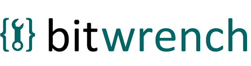

# bitwrench.js

[](https://opensource.org/licenses/BSD-2-Clause)
[](https://www.npmjs.com/package/bitwrench)
[](https://github.com/deftio/bitwrench/actions/workflows/ci.yml)
[](https://github.com/deftio/bitwrench)

[](https://deftio.github.io/bitwrench/pages/)

Bitwrench is a UI library that builds interfaces from plain JavaScript objects -- one format for components, styling, state, and server rendering, with no build step and zero dependencies.

```javascript
// A "TACO" -- Tag, Attributes, Content, Options
var page = {
  t: 'div', a: { class: 'card' },
  c: [
    { t: 'h2', c: 'Hello' },
    { t: 'p',  c: 'UI as native JavaScript objects.' },
    { t: 'button', a: { onclick: function() { alert('clicked'); } }, c: 'Click me' }
  ]
};

bw.mount('#app', page);        // -> live DOM
bw.html(page);                 // -> HTML string (Node.js, emails, SSR)
```

Each object has four keys: **t** (tag), **a** (attributes, including event handlers like `onclick`), **c** (content -- a string, array, or nested TACO), and **o** (options for state and lifecycle). Nest them, loop them, build them with functions -- they are ordinary JavaScript values.

A TACO is already a JavaScript object, so there is nothing to compile or transform. This makes bitwrench a good fit for situations where a build pipeline costs more than it buys: dashboards, internal tools, embedded device UIs, server-driven pages, or anything you want to ship as a single HTML file.

## Installation

```bash
npm install bitwrench
```

```javascript
// ES module
import bw from 'bitwrench';

// CommonJS
const bw = require('bitwrench');
```

Or include directly in a page:

```html
<script src="https://cdn.jsdelivr.net/npm/bitwrench/dist/bitwrench.umd.min.js"></script>
```

## Getting Started

A complete page -- no build step, no imports, everything is a plain object:

```html
<!DOCTYPE html>
<html lang="en">
<head>
  <script src="https://cdn.jsdelivr.net/npm/bitwrench/dist/bitwrench.umd.min.js"></script>
</head>
<body>
  <div id="app"></div>
  <script>
    bw.loadStyles();   // structural CSS + design tokens

    bw.mount('#app', {
      t: 'div', a: { class: 'bw_container' },
      c: [
        { t: 'h1', c: 'My App' },
        { t: 'p',  c: 'Built from plain JavaScript objects.' },
        { t: 'button',
          a: { class: 'bw_btn bw_primary', onclick: function() { alert('Hello!'); } },
          c: 'Click me' }
      ]
    });
  </script>
</body>
</html>
```

## Components

A component is a function that returns a TACO. Bitwrench ships ~50 factory functions (`bw.makeCard()`, `bw.makeTable()`, `bw.makeTabs()`, etc. -- see the [Component Cheat Sheet](docs/component-cheatsheet.md)). Each is a regular function that returns the same `{t, a, c, o}` object you could write by hand. Log the return value and look at it.

Your own components work the same way:

```javascript
function statusChip(label, ok) {
  return { t: 'span', a: { class: 'bw_badge ' + (ok ? 'bw_success' : 'bw_warning') }, c: label };
}

// Built-in and custom components compose identically
bw.mount('#app', {
  t: 'div', a: { class: 'bw_container' },
  c: [
    bw.makeCard({ title: 'Server', content: 'Build 2.1.0' }),
    statusChip('online', true)
  ]
});
```

## State and Updates

Add `o.state` and `o.render` to any TACO to make it stateful. The render function receives `(el, state)`, and you call `bw.refresh(el)` when you want it to re-run:

```javascript
var counter = {
  t: 'div',
  o: {
    state: { count: 0 },
    render: function(el, state) {
      bw.mount(el, {
        t: 'div', c: [
          { t: 'h3', c: 'Count: ' + state.count },
          bw.makeButton({ text: '+1', onclick: function() {
            state.count++;
            bw.refresh(el);
          }})
        ]
      });
    }
  }
};

bw.mount('#app', counter);
```

State is also available as `el._bw_state` from outside the render function -- useful for debugging or direct access from event handlers.

> Event handlers go in `a: { onclick: fn }`, not in `o.mounted`. Handlers attached via `addEventListener` in `o.mounted` are lost when a component re-renders. Place them in `a:` and bitwrench re-attaches them on every render.

Bitwrench has no reactivity system. Mutating state does not trigger anything -- the DOM changes only when you call an update function. This is a deliberate trade: you give up automatic re-renders, and in exchange every DOM mutation is a function call you wrote, with a cost you chose.

The update functions form a cost ladder:

| Update verb | Cost | What happens |
| --- | --- | --- |
| `el.bw.method()` / slot setters | Surgical | Component updates its own DOM directly |
| `bw.update(ref, data)` | Dispatch | Calls `el.bw.update(data)` -- never rebuilds |
| `bw.message(ref, action, data)` | Dispatch | Calls `el.bw[action]()` by selector or UUID |
| `bw.patch(id, content)` | Targeted | Replaces one element's content |
| `bw.refresh(ref)` | Full rebuild | Re-runs `o.render`; children are unmounted and rebuilt |

Choosing where you sit on this ladder is the programming model. The full `bw.refresh()` re-render shown above is the simplest but most expensive option. The next section introduces slots and handles, which sit at the top of the ladder.

## Component API

After mounting, the DOM element is the component. The TACO is consumed at mount time -- there is no virtual DOM and no retained tree. State lives on the element (`el._bw_state`), and so does its public API (`el.bw`).

**Slots** map CSS selectors to setter/getter pairs. **Handles** define named methods. Both are attached to `el.bw` at mount time:

```javascript
var card = bw.mount('#stats', {
  t: 'div', a: { class: 'stats-card' },
  c: [
    { t: 'h3', a: { class: 'card-title' }, c: 'Revenue' },
    { t: 'span', a: { class: 'card-value' }, c: '$50,000' }
  ],
  o: {
    slots: { title: '.card-title', value: '.card-value' },
    handle: {
      update: function(el, data) { el.bw.setValue('$' + data.value.toLocaleString()); }
    }
  }
});

card.bw.setTitle('Profit');          // slot setter -- updates one text node
card.bw.update({ value: 120000 });   // handle method -- runs your logic
bw.update(card, { value: 99000 });   // same call, dispatched by element or UUID
```

`slots: { title: '.card-title' }` generates `el.bw.setTitle()` and `el.bw.getTitle()` automatically. `handle` methods are attached as-is to `el.bw`. Neither causes a re-render -- they update the DOM directly.

Because everything lives on the element, debugging needs no extension: select a component in the browser's Elements panel and type `$0._bw_state` or `$0.bw`.

A component's lifecycle is four explicit calls:

| Phase | You call | Opt-in hook |
| --- | --- | --- |
| Define | a function that returns a TACO | -- |
| Mount | bw.mount('#app', taco) | o.mounted(el) |
| Update | el.bw.method() / bw.refresh(el) | -- |
| Unmount | bw.remove(el) | o.unmount(el) |

The [Component Lifecycle Walkthrough](docs/component-lifecycle.md) takes one card through all four phases. The [State Management guide](docs/state-management.md) covers the full component model.

## Cross-Component Communication

Components communicate through pub/sub. `bw.sub()` returns an unsubscribe function. Wildcard topics match any suffix after the colon:

```javascript
bw.sub('item-added', function(detail) { console.log('New:', detail.name); });
bw.pub('item-added', { name: 'Widget' });
bw.sub('item:*', function(detail, topic) { /* matches item:added, item:removed, etc. */ });
```

Pass an element as the third argument to tie the subscription's lifetime to that element -- when the element is removed from the DOM, the subscription is automatically cleaned up:

```javascript
bw.sub('cart:updated', function(data) {
  el._bw_state.count = data.count;
  bw.refresh(el);
}, el);
```

## CSS from JavaScript

`bw.css()` generates CSS strings from objects. `bw.injectCSS()` inserts a CSS string into the document as a `<style>` tag. `bw.s()` composes inline styles. `bw.responsive()` generates `@media` rules from a breakpoint map. These are generation functions -- they return strings, so you can use them anywhere:

```javascript
// Generate and inject a stylesheet
bw.injectCSS(bw.css({
  '.my-card': { padding: '1rem', borderRadius: '8px' }
}));

// Compose inline styles from reusable objects
{ t: 'div', a: { style: bw.s({ display: 'flex' }, { gap: '1rem' }, { padding: '1rem' }) } }

// Responsive breakpoints
bw.responsive('.hero', {
  base: { fontSize: '1.5rem' },
  md:   { fontSize: '2.5rem' }
});
```

Bitwrench does not own your CSS. You can use external stylesheets, Tailwind, or plain CSS alongside any of the above.

## Theming

`bw.loadStyles()` derives a complete design system -- buttons, alerts, badges, cards, forms, tables, hover states, focus rings -- from two seed colors. Call it with no arguments for structural CSS only, or pass a config to generate a full theme. `bw.toggleThemeMode()` switches between primary and alternate palettes:

```javascript
bw.loadStyles({
  primary: '#336699',
  secondary: '#cc6633'
});

bw.toggleThemeMode();  // switch to alternate palette
```

Styles can be scoped to DOM subtrees, so different parts of a page can use different themes. See the [Theming guide](docs/theming.md) for presets, palette structure, and scoping.

## Server-Driven UI

Because TACOs are plain objects, they serialize as JSON. This means a backend in any language can push UI updates to the browser.

Bitwrench includes bwserve, a protocol that sends TACO objects and patches over SSE. Button clicks come back as actions, `client.inspect()` reads DOM state, and `client.screenshot()` captures the live page as a PNG. The browser becomes a display and input device; the application logic lives wherever you want it.

Here is a C program on an ESP32 pushing a sensor reading to the browser:

```c
char msg[96], frame[128];
BW_PATCH(msg, "office-temp", "23.5");
BW_SSE_FRAME(frame, msg);
events.send(frame, NULL, millis());    // the browser updates
```

The same protocol works from Python, Go, Rust, or a shell script with `curl`. See the [bwserve docs](docs/bwserve.md) for the full protocol, and the [ESP32 tutorial](docs/tutorial-embedded.md) for a complete embedded walkthrough.

The library is ~165KB on disk (~45KB gzipped). A lean build without the component library (BCCL) is ~128KB (~35KB gzipped). Both work entirely self-hosted from a microcontroller's flash -- no CDN and no internet required.

## CLI

`bwcli` converts files to styled standalone pages:

```bash
# Convert Markdown to a self-contained HTML page
bwcli README.md -o index.html --standalone

# Apply a theme preset
bwcli doc.md -o doc.html --standalone --theme ocean

# Custom colors
bwcli doc.md -o doc.html --standalone --theme "#336699,#cc6633"
```

Flags: `--output/-o`, `--standalone/-s`, `--cdn`, `--theme/-t`, `--css/-c`, `--title`, `--favicon/-f`, `--highlight`, `--verbose/-v`

### Pipe Server

`bwcli serve` turns any language into a bwserve backend -- send JSON protocol messages via HTTP POST or stdin, and connected browsers update in real time:

```bash
bwcli serve --port 8080 --input-port 9000
curl -X POST http://localhost:9000 -d '{"type":"patch","ref":"temp","content":"23.5 C"}'
```

## Coming from Other Frameworks

| You're using | For | Bitwrench equivalent |
| --- | --- | --- |
| React / Vue / Svelte | Components | {t, a, c, o} objects + o.state + o.render |
| JSX / templates | Markup-in-JS | Native JS objects -- no compiler |
| Tailwind / CSS-in-JS | Styling | bw.css(), bw.s() |
| Sass / PostCSS | CSS generation | bw.css() from JS objects (supports @media, @keyframes) |
| ThemeProvider / CSS vars | Theming | bw.loadStyles() / bw.makeStyles() from seed colors |
| Streamlit / Gradio | Server-driven UI | bwserve SSE -- from any language |
| Redux / Zustand / Pinia | State management | o.state + bw.refresh() + bw.pub()/sub() |
| Vite / webpack / Babel | Build tooling | Not needed -- open the HTML file |
| DefinitelyTyped / @types | Type declarations | Ships dist/bitwrench.d.ts |

See the [Framework Translation Table](docs/framework-translation-table.md) for side-by-side code comparisons across 22 operations.

## Core API

| Function | Description |
| --- | --- |
| bw.html(obj) | Convert a TACO to an HTML string |
| bw.mount(selector, obj) | Mount a TACO into a DOM element; returns the root element |
| bw.DOM(selector, obj) | Alias of bw.mount() |
| bw.create(taco) | Create a detached DOM element from a TACO (not inserted into the page) |
| bw.el(selector, apply?) | Find an element; optionally apply text, TACO, or function to it |
| bw.$(selector) | querySelectorAll as an array |
| bw.raw(str) | Mark a string as pre-escaped HTML (no double-escaping) |
| bw.css(rules) | Generate CSS from a JS object |
| bw.injectCSS(css, opts?) | Insert a CSS string into the document as a style tag |
| bw.s(...objs) | Compose inline style objects into a style string |
| bw.responsive(sel, breakpoints) | Generate @media CSS rules from a breakpoint map |
| bw.loadStyles(config?) | Structural CSS (no args) or generate + apply a theme from seed colors |
| bw.makeStyles(config) | Generate a theme from seed colors (returns styles object) |
| bw.applyStyles(styles) | Inject a generated styles object into the document |
| bw.toggleThemeMode(scope?) | Switch between primary and alternate palettes |
| bw.clearStyles() | Remove injected theme styles |
| bw.patch(id, content) | Update a specific element by id or UUID |
| bw.refresh(el) | Re-render a stateful component via its o.render function |
| bw.update(el, data) | Dispatch to el.bw.update(data) |
| bw.message(target, action, data) | Dispatch to el.bw[action]() by selector or UUID |
| bw.pub(topic, detail) | Publish to subscribers (exact + wildcard matches) |
| bw.sub(topic, handler, el?) | Subscribe to a topic (supports wildcard 'ns:*'); returns unsub function |
| bw.once(topic, handler, el?) | One-shot subscribe; auto-unsub after first fire |
| bw.remove(el) | Unmount a component (fires o.unmount hook) |
| bw.inspect(target, depth) | Introspect a DOM subtree with bitwrench metadata |
| bw.apply(msg) | Apply a bwserve protocol message to the DOM |

The update functions (`bw.patch`, `bw.refresh`, `bw.update`, `bw.message`) form a cost ladder -- see [State and Updates](#state-and-updates). Full [API Reference](https://deftio.github.io/bitwrench/pages/08-api-reference.html).

## Build Formats

| Format | File | Use case |
| --- | --- | --- |
| UMD | bitwrench.umd.min.js | Browsers and Node.js |
| ESM | bitwrench.esm.min.js | Modern bundlers (Vite, webpack, etc.) |
| CJS | bitwrench.cjs.min.js | Node.js require() |
| ES5 | bitwrench.es5.min.js | Legacy browsers (IE11) |

All formats include source maps. A separate CSS file (`bitwrench.css`) is also available for use without JavaScript.

## Documentation

**Start here:**

- **[Thinking in Bitwrench](docs/thinking-in-bitwrench.md)** -- the complete guide: TACO format, styling, composition, events, the component model, bwserve, and common patterns
- **[LLM Guide](docs/llm-bitwrench-guide.md)** -- compact single-file reference with all APIs, patterns, and rules

**Reference guides** (in `docs/`):

- [TACO Format](docs/taco-format.md) -- the `{t, a, c, o}` object format
- [Component Lifecycle Walkthrough](docs/component-lifecycle.md) -- one stats card through all four phases
- [State Management](docs/state-management.md) -- component model, explicit updates, cross-component communication
- [Component Library](docs/component-library.md) -- all `make*()` functions with signatures and examples
- [Theming](docs/theming.md) -- palette-driven theme generation, presets, design tokens
- [CLI](docs/cli.md) -- the `bwcli` command for file conversion and pipe server
- [bwserve](docs/bwserve.md) -- server-driven UI protocol (SSE, actions, embedded devices)

**Tutorials:**

- [Build a Website](docs/tutorial-website.md) -- multi-section landing page from TACO objects
- [bwserve Dashboard](docs/tutorial-bwserve.md) -- Streamlit-style server-push dashboard
- [ESP32 IoT Dashboard](docs/tutorial-embedded.md) -- embedded sensor dashboard with C macros

**Interactive demos** (live site):

- [Quick Start](https://deftio.github.io/bitwrench/pages/00-quick-start.html) -- first steps with `bw.DOM()`
- [Components](https://deftio.github.io/bitwrench/pages/01-components.html) -- all UI components with live demos
- [Styling & Theming](https://deftio.github.io/bitwrench/pages/03-styling.html) -- CSS generation, `bw.s()`, and theming strategies
- [State & Interactivity](https://deftio.github.io/bitwrench/pages/05-state.html) -- state patterns and stateful TACO
- [Tic Tac Toe Tutorial](https://deftio.github.io/bitwrench/pages/06-tic-tac-toe-tutorial.html) -- step-by-step game with state management
- [Framework Comparison](https://deftio.github.io/bitwrench/pages/07-framework-comparison.html) -- bitwrench vs React, Vue, Svelte
- [Themes](https://deftio.github.io/bitwrench/pages/10-themes.html) -- interactive theme generator with presets and CSS export

**Example apps** (in `examples/`):

- [Ember & Oak Coffee Co.](examples/ember-and-oak/) -- full landing page: theme, cart, search, charts, accordion, timeline
- [SunForge Landing Page](examples/landing-page/) -- marketing page with zero reactive state, pure BCCL composition
- [Todo App](examples/todo-app/) -- stateful TACO with pub/sub
- [Metrics Dashboard](examples/dashboard/) -- live stat cards, bar chart, pub/sub, responsive layout
- [Signup Wizard](examples/wizard/) -- multi-step form, state transitions, bw.raw()
- [Live Feed](examples/live-feed/) -- real-time stream, bw.patch(), slide-in animation
- [IoT Dashboard](examples/embedded/) -- ESP32-style sensor dashboard with SSE
- [bwserve Counter](examples/client-server/) -- server-driven UI demo
- [LLM Chat](examples/llm-chat/) -- streaming chat via bwserve + Ollama/OpenAI

## FAQ

**Is this a framework?** -- No. It is a library (165KB on disk, 45KB gzipped). No lifecycle ceremony, no project structure. Import it, call functions, done. Lifecycle hooks (`o.mounted`, `o.unmount`) are opt-in.

**How does bitwrench compare to React/Vue?** -- They solve different problems at different scales. React and Vue provide a component model, virtual DOM, and ecosystem for large team-built SPAs. Bitwrench provides rendering and state primitives in a single file with no build step, aimed at single-page tools, dashboards, embedded devices, and server-driven UIs. They coexist fine.

**How does CSS work?** -- Bitwrench does not own your CSS. Use any external stylesheet, Tailwind, or CSS file you want. On top of that, `bw.css()` generates CSS from JS objects (with `@media`, `@keyframes`, pseudo-classes), `bw.s()` composes inline style objects, and `bw.loadStyles()` derives a complete design system from seed colors. Use all three or none.

**What's the difference between `bw.mount()` and `bw.html()`?** -- Same TACO input, two outputs. `bw.mount('#app', taco)` mounts live DOM elements in a browser. `bw.html(taco)` returns an HTML string for Node.js scripts, email generators, static site builds, or anywhere you need markup without a browser. (`bw.DOM()` is an alias for `bw.mount()`.)

**What is bwserve?** -- A protocol that turns the browser into a display and input device for a program running anywhere. The server pushes TACO objects and patches over SSE; button clicks come back as actions; `client.inspect()` returns DOM state; `client.screenshot()` returns a PNG. Language-agnostic: Python, Go, Rust, C, or a shell script with `curl`. See the [bwserve docs](docs/bwserve.md).

**Can I use bitwrench on embedded devices?** -- Yes. The device serves one HTML page plus the library from flash, no CDN required. Build the UI as TACOs in whatever language the device speaks (C, C++, MicroPython), push updates over SSE, and get button presses back the same way. C macros ship in `embedded_c/`. See the [ESP32 tutorial](docs/tutorial-embedded.md) and the [Pico W example](examples/embedded-pico-w/).

**Can I use it with TypeScript?** -- Yes. Type declarations ship with the package (`dist/bitwrench.d.ts`). See the [TypeScript Usage Guide](docs/bitwrench_typescript_usage.md).

**What about accessibility?** -- BCCL components emit semantic HTML with ARIA attributes where applicable. You can add any `aria-*` attribute via `a: { 'aria-label': '...' }`.

## Development

```bash
npm install          # install dev dependencies
npm run build        # build all dist formats (UMD, ESM, CJS, ES5)
npm test             # run unit tests
npm run test:cli     # run CLI tests
npm run test:e2e     # run Playwright browser tests
npm run lint         # run ESLint
npm run cleanbuild   # full production build with SRI hashes
```

## License

[BSD-2-Clause](./LICENSE.txt) -- (c) M. A. Chatterjee / [deftio](https://github.com/deftio) -- use it in your own projects or commercially.
